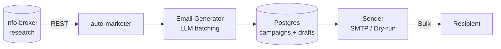

# auto-marketer

Personalized cold email generation and bulk sending. Pure marketing layer of a two-service stack — pair it with the sibling [`info-broker`](https://github.com/rinehardramos/info-broker) service which supplies prospect profiles over REST.

auto-marketer is a focused, high-performance outreach engine. It does not scrape, ingest, or research prospects directly — those responsibilities have moved to the sibling `info-broker` service. This split allows for cleaner scaling and specialized agents for both the research and marketing phases of the pipeline.

## Pipeline flow



## Key features

- **Two-service architecture:** Consumes prospect data from `info-broker` via a robust REST client with tenacity-based retries.
- **Campaign management:** Organize outreach into campaigns with specific tones, goals, and target profiles.
- **High-throughput generation:** Parallelized email drafting via Google Gemini (default) or any OpenAI-compatible LLM — provider-selectable at runtime.
- **Safety-first sending:** Native support for `dry-run` providers to preview outreach before live SMTP delivery.
- **Smart rate-limiting:** Granular control over sending velocity to protect your domain reputation.
- **Flexible exports:** Campaign results available in JSON, CSV, and XLSX formats for CRM integration.
- **Hardened security:** Parameterized SQL enforced by Ruff and AST-based scanners, SSRF protection, and CSV injection guards.

## Quickstart

Prerequisites: Python 3.10+, [`uv`](https://github.com/astral-sh/uv), Docker Desktop, and a Gemini API key (or an OpenAI-compatible LLM server for the `lmstudio` provider).

1. **Clone and install:**
   ```bash
   uv sync --extra dev
   ```

2. **Infrastructure:**
   ```bash
   docker compose up -d postgres
   ```

3. **Configuration:**
   ```bash
   cp .env.example .env
   # Set INFO_BROKER_BASE_URL, INFO_BROKER_API_KEY, AUTO_MARKETER_API_KEY,
   # and your LLM provider details.
   ```

4. **Launch API:**
   ```bash
   uv run uvicorn app.main:app --reload --port 8001
   ```

## Usage

### API Examples

```bash
# Create a campaign
curl -X POST http://localhost:8001/campaigns \
  -H "X-API-Key: $AUTO_MARKETER_API_KEY" -H "Content-Type: application/json" \
  -d '{"name":"Q2 SMB push","tone":"warm","goal":"book a 15-min discovery call"}'

# Generate drafts (pulls profiles from info-broker)
curl -X POST http://localhost:8001/campaigns/1/generate \
  -H "X-API-Key: $AUTO_MARKETER_API_KEY" -H "Content-Type: application/json" \
  -d '{"limit": 50, "workers": 4}'

# Review / edit a draft
curl -X PATCH http://localhost:8001/drafts/12 \
  -H "X-API-Key: $AUTO_MARKETER_API_KEY" -H "Content-Type: application/json" \
  -d '{"subject":"New subject","body":"Edited body"}'

# Real send (after dry-run looks right)
curl -X POST http://localhost:8001/campaigns/1/send \
  -H "X-API-Key: $AUTO_MARKETER_API_KEY" -H "Content-Type: application/json" \
  -d '{"provider":"smtp","rate_limit_per_min":30}'
```

### CLI

```bash
auto-marketer campaign create --name "Q2 push" --tone warm --goal "book demos"
auto-marketer generate --campaign-id 1 --limit 50
auto-marketer send --campaign-id 1 --provider dry-run --rate-limit 30
auto-marketer export --campaign-id 1 --format csv --output q2.csv
```

## Documentation

- [Architecture Overview](docs/architecture.md) — The two-service split and data flow.
- [Campaign Lifecycle](docs/campaigns.md) — Creating, managing, and executing campaigns.
- [Sending & Rate Limiting](docs/sending.md) — Provider configuration and bulk sending safety.
- [Security Model](SECURITY.md) — Threat model and security controls.

## Security

See [SECURITY.md](SECURITY.md) for details on our runtime threat model and supply-chain hardening workflow.

## License

See `LICENSE`.
